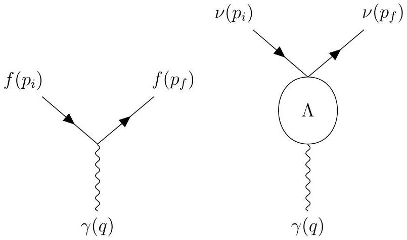

#Neutrino Magnetic Moment Analysis

## Extension to Standard Model

This analysis into the magnetic moment of neutrinos  attempts to explore one extension to the standard model.
The standard model claims that neutrinos are electrically neutral particles.
As far as observation goes, they are electrically neutral at least at the tree level.
Things that happen at the leading order of the coupling constant are called tree level processes. 

If we allow an extension to the standard model, we can start to take into account  higher level perturbative effects.
These effects allow for electromagnetic interactions at the quantum level as shown in Fig. \ref{loopDiagram}.

Note: 
