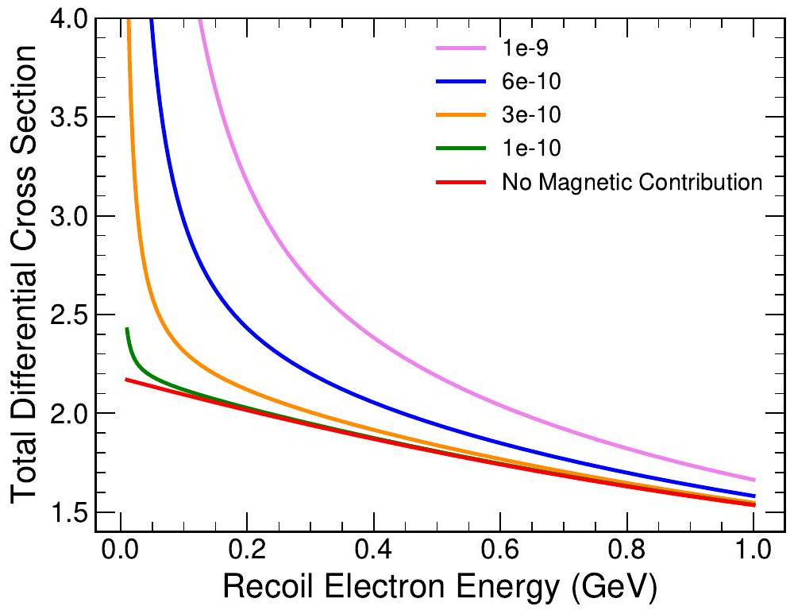

#Neutrino Magnetic Moment Analysis

## Extension to Standard Model

This analysis into the magnetic moment of neutrinos  attempts to explore one extension to the standard model.
The standard model claims that neutrinos are electrically neutral particles.
As far as observation goes, they are electrically neutral at least at the tree level.
Things that happen at the leading order of the coupling constant are called tree level processes. 

If we allow an extension to the standard model, we can start to take into account  higher level perturbative effects.
These effects allow for electromagnetic interactions at the quantum level as shown in the loop diagram below.

Neutrinos cannot couple at the tree level as shown in the left side of the above figure  but under this extension can do so through quantum effects coming from the loop as shown in the right hand side.
While the general process is the same, the vertex function $\lambda $ gives additional information.
Ordinarily magnetic moment comes from the internal quark structure which cannot happen for neutrinos since they don't have internal quark structure, but the loop level effects still allows for a magnetic moment to occur.

When looking at the differential cross section, there is both a standard model contribution  as well as a magnetic contribution that add incoherently

Decreasing the recoil kinetic energy of the electron leads to a  decrease in the standard model contribution  and an increase in the magnetic contribution.
